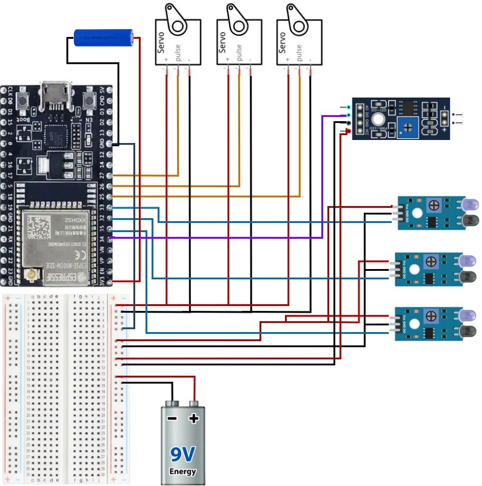
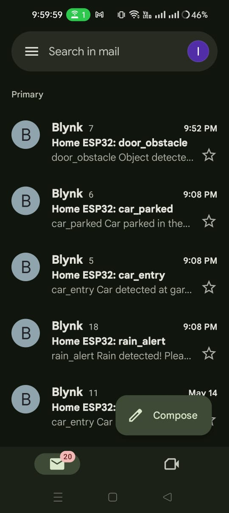

<p align="center">
  
</p>

<p align="center">
  
</p>

<p align="center">
  <a href="https://github.com/asm-hanif">
    
  </a>
  <a href="https://github.com/asm-hanif?tab=repositories">
    
  </a>
  
</p>

<br>

<p align="center">
  <strong>💻 Software Developer &nbsp;•&nbsp; 📱 Android Developer &nbsp;•&nbsp; 🌐 Full-Stack Developer</strong>
</p>

<p align="center">
  <em>Building useful technology that solves real-world problems.</em>
</p>

<br>

---

# 🧠 About Me

<table>
<tr>
<td width="55%" valign="top">

### 👋 Hey, I'm Hanif

I'm an undergraduate **Computer Science & Engineering** student passionate about transforming ideas into practical software.

I enjoy working across the entire development stack — from designing interfaces and building Android applications to developing scalable backend systems and experimenting with Machine Learning.

### 🎯 Currently Focused On

* 🤖 Machine Learning & AI
* ☁️ AWS AI/ML & Cloud Architecture
* 📱 Modern Android Development
* 🌐 Full-Stack Web Development
* 🔌 IoT & Smart Systems
* 🧩 Scalable Backend Architecture

</td>

<td width="45%" valign="top">

### ⚡ Quick Profile

```text
🎓 Education
CSE @ Premier University
Graduating: 2027

💻 Development
Full-Stack + Android

🧠 Interests
AI • ML • IoT • Cloud

⚙️ Backend
ASP.NET Core • Node.js

📱 Mobile
Kotlin • Jetpack Compose

🗄️ Database
MS SQL • PostgreSQL • Firebase

🌱 Learning
AWS AI/ML
Cloud-Native Architecture
```

</td>
</tr>
</table>

<br>

---

# 🛠️ Tech Arsenal

<p align="center">

### 💻 Languages


<br><br>

### 🌐 Web & Backend


<br><br>

### 📱 Mobile & Cloud


<br><br>

### 🗄️ Database & Tools


</p>

<br>

---

# 🚀 Featured Projects

## 🏥 EasySheba

### Healthcare Management & Medical Service Platform

> A comprehensive healthcare platform designed to connect patients with doctors, hospitals, diagnostic services, appointments and medical resources.

<table>
<tr>
<td>

**✨ Key Features**

* 🩺 Doctor appointment booking
* 🧪 Medical test scheduling
* 🛏️ Bed reservation
* 👨‍⚕️ Doctor management
* 🏥 Hospital management
* 🔐 Role-based authentication
* 📊 Administrative dashboards
* 📍 Google Maps integration

</td>
<td>

**⚙️ Technology**

```text
ASP.NET Core MVC
C#
Entity Framework
Microsoft SQL Server
Bootstrap
jQuery
Google Maps API
ASP.NET Identity
```

</td>
</tr>
</table>

<p align="center">
  
  
  <br><br>
  
  
</p>

---

## 🛠️ KajLagbe

### Local Service Marketplace

> A mobile marketplace connecting people who need services with local service providers.

<table>
<tr>
<td width="50%">

### 🔥 Features

* 🔐 Firebase Authentication
* 💬 Real-time messaging
* ⭐ Rating & review system
* 👤 Service provider profiles
* 📍 Local service discovery
* ⚡ Real-time data synchronization

</td>

<td width="50%">

### 📱 Built With


<br><br>

**Architecture**

```text
Kotlin
Jetpack Compose
Firebase Auth
Cloud Firestore
Firebase Storage
```

</td>
</tr>
</table>

<p align="center">
  
  
</p>

---

## 🌐 Campus Network System

### University Network Simulation

> A complete simulated university network designed to demonstrate enterprise networking, routing, switching and security concepts.

<table>
<tr>
<td>

### 🔌 Networking

* VLAN configuration
* ACL implementation
* Routing
* Access switching
* Serial connections
* Email server
* IoT integration
* Cloud connectivity

</td>

<td>

### 🧰 Tools

```text
Cisco Packet Tracer

Routers
Core Switches
Access Switches
VLANs
ACLs
IoT Devices
Servers
```

</td>
</tr>
</table>

<p align="center">
  
</p>

---

## 🏙️ NagarFix

### Smart City Service Platform

> A citizen-focused platform that allows people to report urban problems and track their resolution.

### 🚧 Problem → Solution

```text
Citizen
   ↓
Report Urban Issue
   ↓
Location Tagging
   ↓
City Corporation
   ↓
Issue Processing
   ↓
Status Updates
   ↓
Citizen Tracking
```

### ✨ Features

* 📍 Location-based issue reporting
* 📸 Issue documentation
* 📊 Resolution tracking
* 🔄 Real-time updates
* 🏙️ Smart city management

**Technology:** Kotlin • Firebase • Android

<p align="center">
  
  
</p>

---

## 🏠 Smart Home System

### ESP32 IoT Automation Project

> An affordable and scalable IoT-based smart home system for remotely controlling household appliances.

<table>
<tr>
<td>

### 🔌 Hardware

* ESP32
* IR Sensors
* Servo Motors
* Rain Sensor
* Wi-Fi connectivity

</td>

<td>

### ⚡ Capabilities

* Remote appliance control
* Real-time device status
* Automated actions
* Wi-Fi communication
* Smart monitoring

</td>
</tr>
</table>

<p align="center">
  
  
</p>

<br>

---

# 📊 GitHub Analytics

<p align="center">
  
  
</p>

<br>

<p align="center">
  
</p>

<br>

---

# 📈 Contribution Activity

<p align="center">
  
</p>

<br>

---

# 🧩 Development Philosophy

<p align="center">

<table>
<tr>
<td align="center" width="25%">

### 🎯

**Solve Problems**

Build technology that has a real purpose.

</td>

<td align="center" width="25%">

### ⚡

**Keep Learning**

Always explore new technologies and ideas.

</td>

<td align="center" width="25%">

### 🧠

**Think Scalable**

Design systems with growth in mind.

</td>

<td align="center" width="25%">

### 🚀

**Build & Ship**

Turn concepts into working products.

</td>
</tr>
</table>

</p>

---

# 🌱 Currently Exploring

<p align="center">

`🤖 Machine Learning`

`☁️ AWS`

`🧠 AI Systems`

`🏗️ Cloud Architecture`

`📱 Advanced Android`

`🔌 IoT`

</p>

---

# 🤝 Let's Connect

<p align="center">

<a href="https://linkedin.com/in/abu-sayed-muhammed-hanif-15b689374/">

</a>

<a href="mailto:abusayed1952hanif@gmail.com">

</a>

<a href="https://github.com/asm-hanif">

</a>

</p>

<br>

---

<p align="center">

### 💙 Thanks for visiting my profile!

**If you find something interesting here, consider ⭐ starring the repository.**

<br>


</p>

<p align="center">
  
</p>
