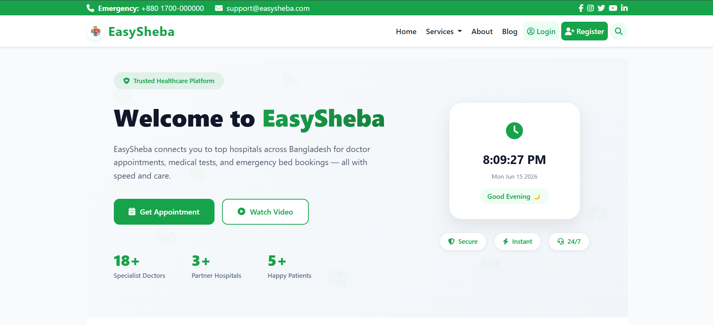
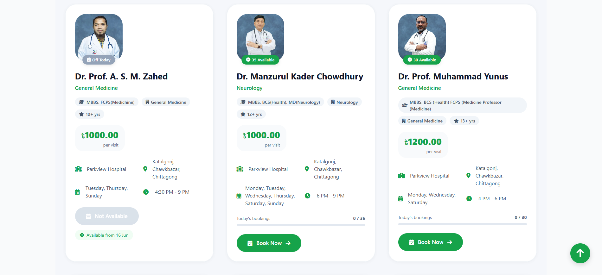
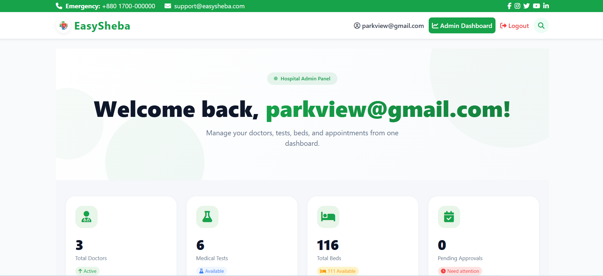
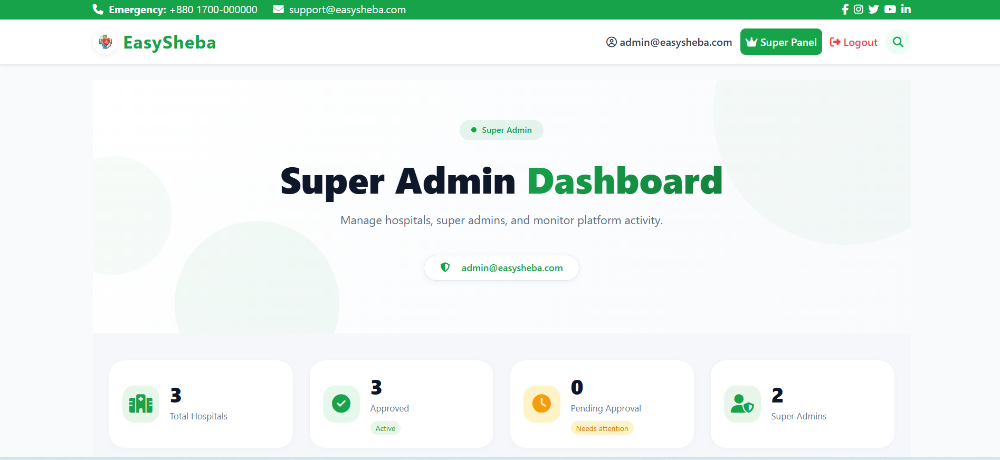
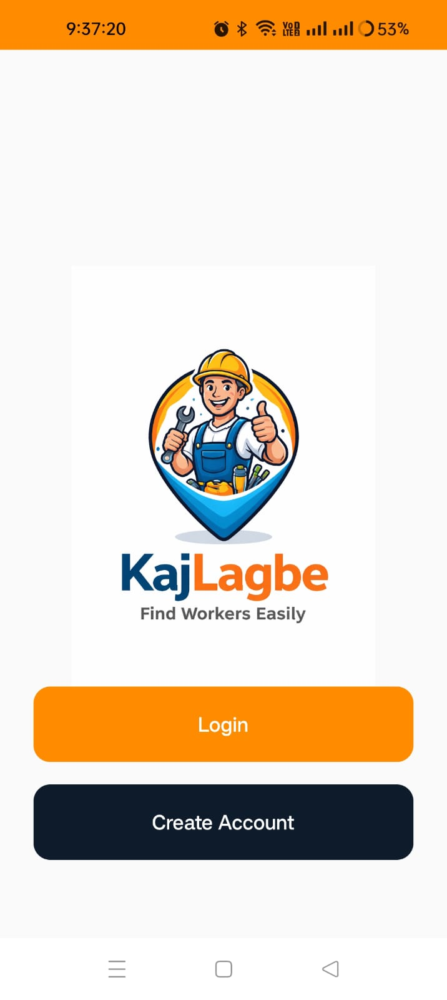
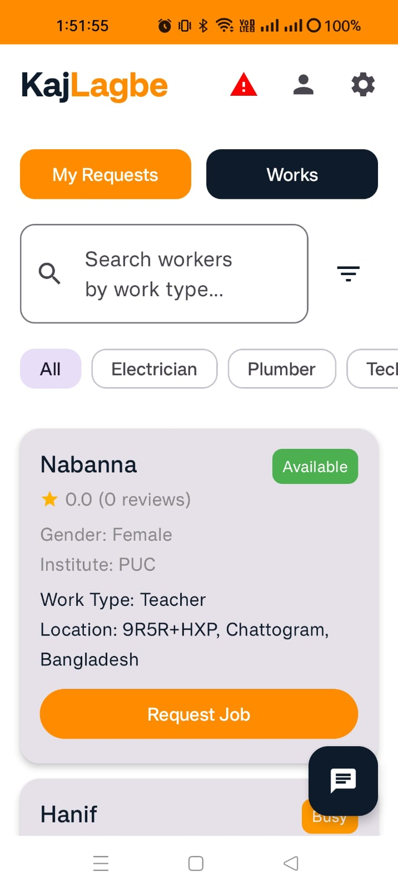
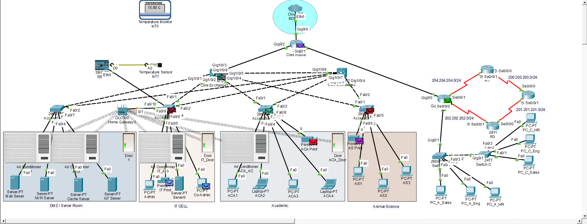
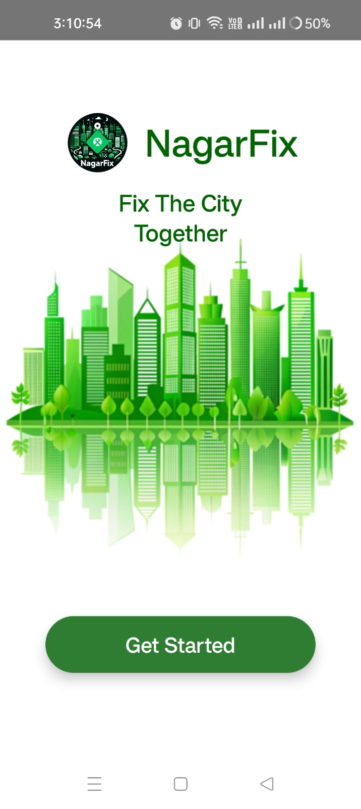
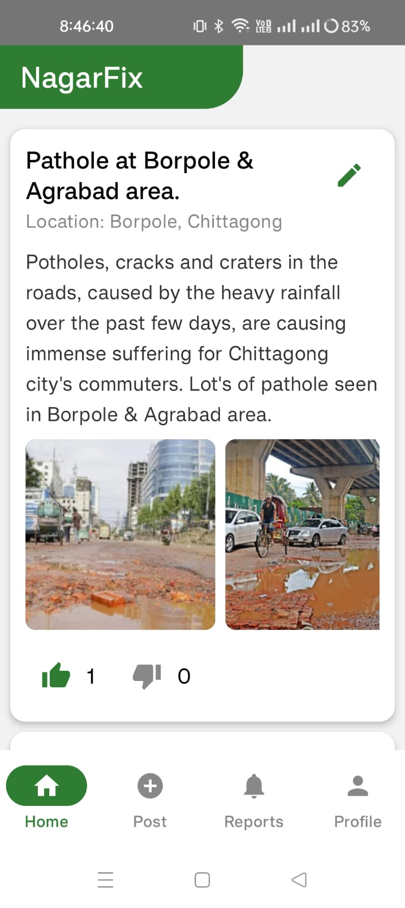

  

<h3 align="center">💻 Software Developer | 📱 Mobile App Developer | 🌐 Web Developer</h3>

🚀 Turning Ideas into Real Applications  
🔥 Building Scalable Web & Mobile Solutions

🚀 About Me

🎓 CSE Undergraduate passionate about real-world problem solving
💡 Full-stack & mobile app developer
📱 Specialized in Jetpack Compose
🌐 Backend experience with ASP.NET Core

🧰 Tech Stack

🏆 Featured Projects

🏥 EasySheba – Healthcare Management System

✔ Appointment Booking
✔ Medical Test Scheduling
✔ Bed Management
✔ Role-Based Dashboard

📸 Screenshots:

  
  
  
  

🛠️ KajLagbe – Service Marketplace App

✔ Worker Hiring System
✔ Firebase Authentication
✔ Real-time Chat
✔ Review System

📸 Screenshots:

  
  

🌐 Campus Network System

✔ Network Simulation
✔ Protocol Demonstration

📸 Screenshots:

  

🏙️ NagarFix – Smart City Service Platform

✔ Issue Reporting System
✔ Real-time Tracking

📸 Screenshots:

  
  

📊 GitHub Stats

  
  

🌐 Connect With Me

  
  

  ⭐ If you like my work, give a star!

